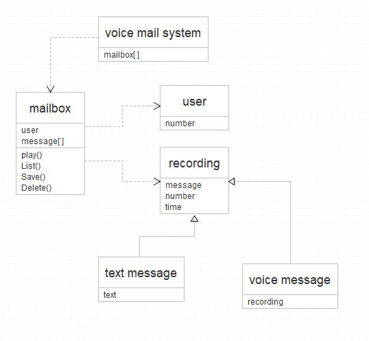
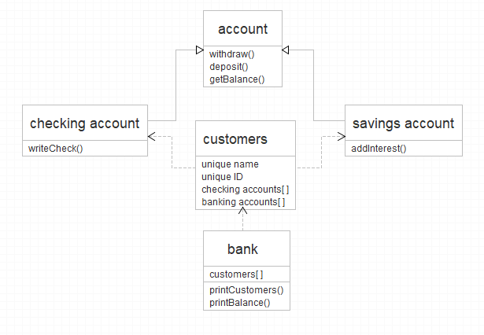

# Java 3: Design and UML

#### Ex 3.1

#### Ex 3.2

#### Ex 3.2

#### Ex 3.4

Employee e0 = new Employee ("Gullible Gus", "555-55-5678", 50000);  
  This works since e0 is declared and instantiated as an Employee  
Employee e1 = new Customer ("Gullible Gus", "555-55-5678", 5);  
  This does not work since both employee and customer extend person but don't relate to each other  
Employee e2 = new Person("Zany Zoe", "112-12-1212");  
  This does not work since the arguements are different: missing an int  
Person p1 = new Customer ("Gullible Gus", "555-55-5678", 5);  
  Person variables can hold subclass instances  
Person p2 = (Person) e0;  
  Casting to a person will work  
Customer c1 = (Person) p1;  
  This does not work since a customer is being casted to the 'Person' parent class  
Customer c2 = p1;  
  Will not work since p1 must be cast to a 'Customer'  
Person p3 = (Employee) e0;  
  Person variables can hold subclass instances  
Person p4 = e0;  
  Same as above  
